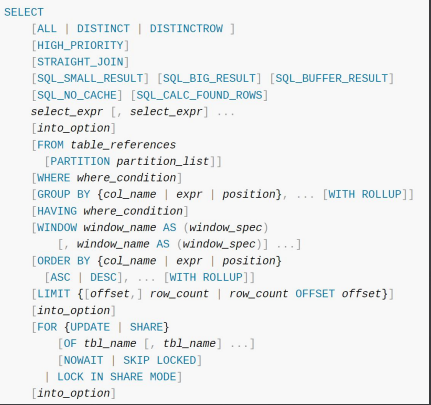

# ORM 起步 —— SQL构造 
### 设计风格决策
- 使用 Builder 模式：SQL 里面的不同语句有不同的实现。
- 使用泛型做类型约束：例如 SELECT 语句和 INSERT 语句。
- 额外引入一个 QueryBuilder：作为构建 SQL 这一个单独步骤的顶级抽象

### SELECT 语句规范
目前我们不考虑多方言兼容，只考虑 MySQL

MySQL 语法规范中重要的部分：
- FROM：普通表、子查询、JOIN 查询
- WHERE：各种查询条件，以及由 AND、OR、NOT 混合在一起的复杂查询条件
- HAVING：可以使用 WHERE 里面的条件，以及使用聚合函数的条件
- ORDER BY
- GROUP BY
- LIMIT 和 OFFSET

从这个规范里面也可以看出来，SELECT 可以说是千变万化，不用 Builder 模式还是很难做的
